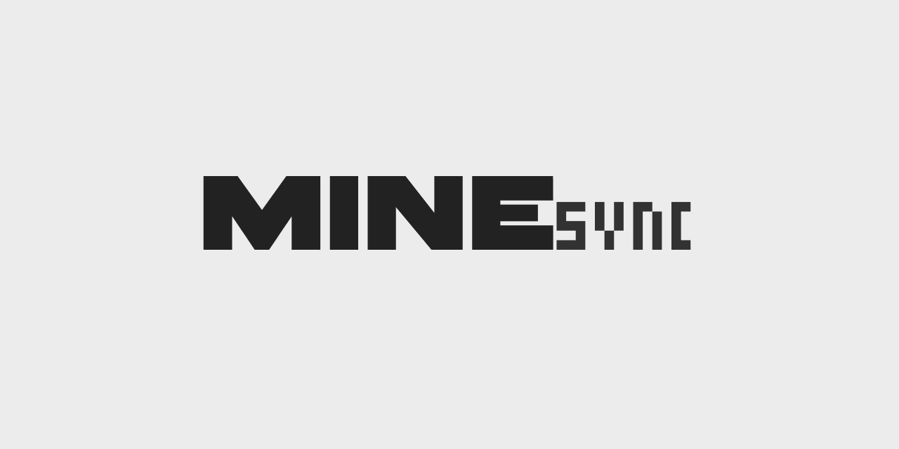

<p align="center">
  
</p>

<h1 align="center">MineSync</h1>

<p align="center">
  <strong>Synchronise tes modpacks Minecraft avec tes amis en P2P</strong>
</p>

<p align="center">
  <a href="#-fonctionnalités">Fonctionnalités</a> •
  <a href="#-installation">Installation</a> •
  <a href="#-utilisation">Utilisation</a> •
  <a href="#-stack-technique">Stack</a> •
  <a href="#-contribuer">Contribuer</a>
</p>

<p align="center">
  
  
  
  
</p>

<p align="center">
  
  
  
</p>

---

## Le Concept

<p align="center">
  
</p>

**MineSync** est un launcher Minecraft open-source qui révolutionne le partage de modpacks. Fini les ZIP de 2Go à envoyer par Google Drive — partage tes mods avec un simple code.

```
Tu créés un modpack → Tu cliques "Partager" → Code MINE-XXXXXX généré
      ↓
Ton ami entre le code → Télécharge auto depuis CurseForge/Modrinth
      ↓
Tu modifies ton modpack → Il voit le diff et synchronise en un clic
```

> **Note :** Seul le **manifeste** (liste des mods) transite en P2P. Les fichiers sont téléchargés directement depuis les plateformes officielles — rapide, sûr, légal.

---

## Fonctionnalités

### Gestion des Modpacks

- **Multi-instances** — Crée autant de modpacks que tu veux avec différentes versions
- **Mod Loaders** — Support complet de Fabric, Quilt, Forge et NeoForge
- **Recherche unifiée** — Browse CurseForge + Modrinth dans une seule interface
- **Résolution de dépendances** — Les libs requises sont installées automatiquement

### Synchronisation P2P

- **Partage instantané** — Génère un code `MINE-XXXXXX` en un clic
- **Preview des changements** — Vois exactement ce qui va être ajouté/supprimé/modifié
- **Sync manuelle** — Tu gardes le contrôle, rien ne s'installe sans ta confirmation
- **Hole punching** — Fonctionne même derrière un NAT grâce à libp2p relay

### Expérience Utilisateur

- **Interface moderne** — UI dark theme élégante avec Tailwind CSS v4
- **Auth Microsoft** — Device Code Flow sécurisé (pas de navigateur intégré)
- **Downloads parallèles** — Téléchargements optimisés avec vérification SHA1
- **Léger** — App native ~15MB, pas d'Electron

---

## Installation

### Prérequis

| Outil | Version | Lien |
|-------|---------|------|
| Node.js | >= 18 | [nodejs.org](https://nodejs.org/) |
| Rust | >= 1.77 | [rustup.rs](https://rustup.rs/) |
| Dépendances système | - | [Tauri Prerequisites](https://v2.tauri.app/start/prerequisites/) |

### Cloner et installer

```bash
git clone https://github.com/votre-username/MineSync.git
cd MineSync
npm install
```

### Configuration

Crée un fichier `.env` à la racine :

```env
CURSEFORGE_API_KEY=your_api_key_here
```

> Obtiens ta clé sur [console.curseforge.com](https://console.curseforge.com/)  
> L'API Modrinth ne nécessite pas de clé.

---

## Utilisation

### Développement

```bash
# Lancer l'app en mode dev (hot reload frontend + backend)
npm run tauri dev

# Vérifier le code Rust
cd src-tauri && cargo check

# Lancer les tests
cd src-tauri && cargo test
```

### Production

```bash
# Build l'application
npm run tauri build
```

Les binaires seront dans `src-tauri/target/release/bundle/`

---

## Stack Technique

<table>
<tr>
<td align="center" width="150">
<br>
<strong>Tauri v2</strong><br>
<sub>Framework Desktop</sub>
</td>
<td align="center" width="150">
<br>
<strong>Rust</strong><br>
<sub>Backend natif</sub>
</td>
<td align="center" width="150">
<br>
<strong>React 19</strong><br>
<sub>Frontend UI</sub>
</td>
<td align="center" width="150">
<br>
<strong>libp2p</strong><br>
<sub>Réseau P2P</sub>
</td>
</tr>
</table>

### Architecture Backend

| Module | Technologie | Rôle |
|--------|-------------|------|
| Runtime | tokio | Async runtime multi-threadé |
| HTTP | reqwest | Client HTTP/TLS |
| Database | rusqlite | SQLite avec WAL mode |
| P2P | libp2p 0.54 | noise, yamux, relay, dcutr, autonat |
| Auth | OAuth 2.0 | Microsoft Device Code Flow |

### Architecture Frontend

| Module | Technologie | Rôle |
|--------|-------------|------|
| Framework | React 19 | UI composants |
| Styling | Tailwind CSS v4 | Dark theme personnalisé |
| Routing | React Router 7 | Navigation SPA |
| Icons | Lucide React | Iconographie moderne |
| IPC | Tauri API | Communication frontend ↔ backend |

---

## Architecture du Projet

```
MineSync/
├── assets/                    # Logo, banner, icônes
├── src/                       # Frontend React
│   ├── components/
│   │   ├── layout/           # TitleBar, Sidebar
│   │   └── ui/               # Button, Card, Modal, etc.
│   ├── pages/                # Home, BrowseMods, SyncHub, etc.
│   ├── hooks/                # useTauriCommand, useDebounce
│   └── lib/                  # Types, IPC helpers
│
├── src-tauri/                 # Backend Rust
│   └── src/
│       ├── lib.rs            # Entry point Tauri
│       ├── errors.rs         # Error handling (thiserror)
│       ├── models/           # Types serde
│       ├── services/
│       │   ├── auth.rs       # Microsoft OAuth
│       │   ├── database.rs   # SQLite CRUD
│       │   ├── download.rs   # Parallel downloads + SHA1
│       │   ├── minecraft.rs  # Mojang API
│       │   ├── loader/       # Fabric, Forge, Quilt, NeoForge
│       │   ├── mod_platform/ # CurseForge + Modrinth
│       │   ├── p2p/          # libp2p swarm
│       │   └── sync_protocol/# Manifest diff algorithm
│       └── commands/         # 38 Tauri IPC commands
│
└── docs/                      # Documentation technique
```

---

## Base de Données

SQLite en mode WAL avec 6 tables :

| Table | Description |
|-------|-------------|
| `accounts` | Comptes Microsoft (tokens chiffrés, profil) |
| `instances` | Instances Minecraft (version, loader, config) |
| `instance_mods` | Mods installés par instance |
| `sync_sessions` | Sessions P2P actives |
| `sync_history` | Historique des synchronisations |
| `loader_installations` | Versions de loaders installées |

---

## Protocole P2P

```
┌─────────────────┐                    ┌─────────────────┐
│   Host (toi)    │                    │   Guest (ami)   │
├─────────────────┤                    ├─────────────────┤
│ 1. Share modpack│                    │                 │
│    → MINE-XXXXXX│─────────────────→  │ 2. Enter code   │
│                 │                    │                 │
│                 │   ←─ Manifest ──   │ 3. Receive list │
│                 │                    │                 │
│                 │                    │ 4. Download from│
│                 │                    │    CF/Modrinth  │
│                 │                    │                 │
│ 5. Update mods  │─────────────────→  │ 6. See diff     │
│                 │                    │    & confirm    │
└─────────────────┘                    └─────────────────┘
```

- **Code de partage** : PeerId encodé en base62
- **Sécurité** : Chiffrement noise, yamux multiplexing
- **NAT traversal** : Relay + DCUtR hole punching
- **Auto-stop** : P2P se coupe au lancement du jeu

---

## Contribuer

Les contributions sont les bienvenues ! 

1. Fork le projet
2. Crée ta branche (`git checkout -b feature/amazing-feature`)
3. Commit tes changements (`git commit -m 'Add amazing feature'`)
4. Push sur la branche (`git push origin feature/amazing-feature`)
5. Ouvre une Pull Request

### Guidelines

- **Rust** : Utilise `thiserror` pour les erreurs, jamais `.unwrap()` en prod
- **Frontend** : Passe toujours par `lib/tauri.ts` pour les appels IPC
- **Commits** : Messages clairs et concis en anglais

---

## Roadmap

- [ ] Support de plus de sources de mods (ATLauncher, Technic)
- [ ] Import/export de modpacks (.mrpack, .zip)
- [ ] Thèmes personnalisables
- [ ] Traductions i18n
- [ ] Mode serveur dédié

---

## Licence

Distribué sous licence MIT. Voir [LICENSE](LICENSE) pour plus d'informations.

---

<p align="center">
  <sub>Built with ❤️ by the MineSync community</sub>
</p>
